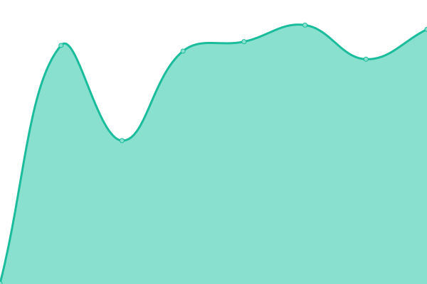
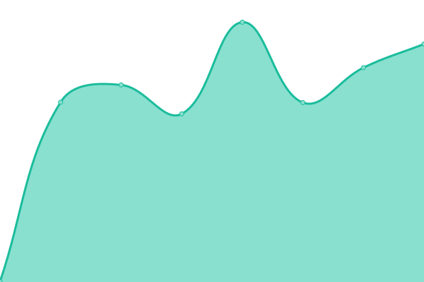

# [📈 Live Status](https://status.bbjprojek.org): <!--live status--> **🟩 All systems operational**

This repository contains the open-source uptime monitor and status page for [bbjprojek](https://bbjprojek.org), powered by [Upptime](https://github.com/upptime/upptime).

With [Upptime](https://upptime.js.org), you can get your own unlimited and free uptime monitor and status page, powered entirely by a GitHub repository. We use [Issues](https://github.com/bbjprojek/status/issues) as incident reports, [Actions](https://github.com/bbjprojek/status/actions) as uptime monitors, and [Pages](https://status.bbjprojek.org) for the status page.

<!--start: status pages-->
<!-- This summary is generated by Upptime (https://github.com/upptime/upptime) -->
<!-- Do not edit this manually, your changes will be overwritten -->
<!-- prettier-ignore -->
| URL | Status | History | Response Time | Uptime |
| --- | ------ | ------- | ------------- | ------ |
|  [BBJProjeK](https://bbjprojek.org) | 🟩 Up | [bbj-proje-k.yml](https://github.com/bbjprojek/status/commits/HEAD/history/bbj-proje-k.yml) | 

 438ms
     
 | 

<a href="https://status.bbjprojek.org/history/bbj-proje-k">100.00%</a>
    

|  [BBJProjeK Documentation](https://wiki.bbjprojek.org) | 🟩 Up | [bbj-proje-k-documentation.yml](https://github.com/bbjprojek/status/commits/HEAD/history/bbj-proje-k-documentation.yml) | 

 601ms
     
 | 

<a href="https://status.bbjprojek.org/history/bbj-proje-k-documentation">100.00%</a>
    

|  [BBJProjeK Mail](https://mail.bbjprojek.org) | 🟩 Up | [bbj-proje-k-mail.yml](https://github.com/bbjprojek/status/commits/HEAD/history/bbj-proje-k-mail.yml) | 

 490ms
     
 | 

<a href="https://status.bbjprojek.org/history/bbj-proje-k-mail">100.00%</a>
    

|  [BBJProjeK CDN](https://cdn.bbjprojek.org) | 🟩 Up | [bbj-proje-k-cdn.yml](https://github.com/bbjprojek/status/commits/HEAD/history/bbj-proje-k-cdn.yml) | 

 329ms
     
 | 

<a href="https://status.bbjprojek.org/history/bbj-proje-k-cdn">100.00%</a>
    

|  [BBJProjeK Git](https://git.bbjprojek.org) | 🟩 Up | [bbj-proje-k-git.yml](https://github.com/bbjprojek/status/commits/HEAD/history/bbj-proje-k-git.yml) | 

 425ms
     
 | 

<a href="https://status.bbjprojek.org/history/bbj-proje-k-git">100.00%</a>
    

|  [Lapiacery Infrastructure](https://lapiacery.bbjprojek.org) | 🟩 Up | [lapiacery-infrastructure.yml](https://github.com/bbjprojek/status/commits/HEAD/history/lapiacery-infrastructure.yml) | 

 236ms
     
 | 

<a href="https://status.bbjprojek.org/history/lapiacery-infrastructure">100.00%</a>
    

|  [BBJProjeK Cabinet & R2](https://cabinet.bbjprojek.org) | 🟩 Up | [bbj-proje-k-cabinet-and-r2.yml](https://github.com/bbjprojek/status/commits/HEAD/history/bbj-proje-k-cabinet-and-r2.yml) | 

 558ms
     
 | 

<a href="https://status.bbjprojek.org/history/bbj-proje-k-cabinet-and-r2">100.00%</a>
    

|  [BBJProjeK Sub-Projects](https://wiki.bbjprojek.org/andenes) | 🟩 Up | [bbj-proje-k-sub-projects.yml](https://github.com/bbjprojek/status/commits/HEAD/history/bbj-proje-k-sub-projects.yml) | 

 190ms
     
 | 

<a href="https://status.bbjprojek.org/history/bbj-proje-k-sub-projects">100.00%</a>
    

<!--end: status pages-->

[**Visit our status website →**](https://status.bbjprojek.org)

## 📄 License

- Powered by: [Upptime](https://github.com/upptime/upptime)
- Code: [MIT](./LICENSE) © [bbjprojek](https://bbjprojek.org)
- Data in the `./history` directory: [Open Database License](https://opendatacommons.org/licenses/odbl/1-0/)
