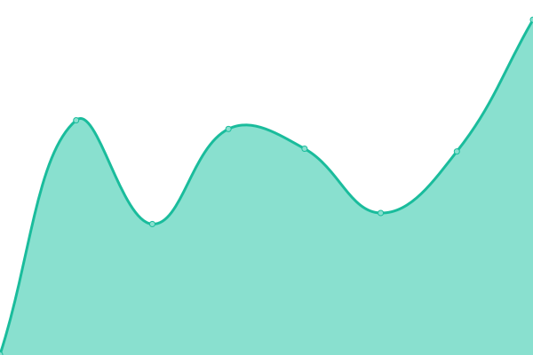

# [📈 Live Status](https://status.bbjprojek.org): <!--live status--> **🟩 All systems operational**

This repository contains the open-source uptime monitor and status page for [bbjprojek](https://bbjprojek.org), powered by [Upptime](https://github.com/upptime/upptime).

With [Upptime](https://upptime.js.org), you can get your own unlimited and free uptime monitor and status page, powered entirely by a GitHub repository. We use [Issues](https://github.com/bbjprojek/status/issues) as incident reports, [Actions](https://github.com/bbjprojek/status/actions) as uptime monitors, and [Pages](https://status.bbjprojek.org) for the status page.

<!--start: status pages-->
<!-- This summary is generated by Upptime (https://github.com/upptime/upptime) -->
<!-- Do not edit this manually, your changes will be overwritten -->
<!-- prettier-ignore -->
| URL | Status | History | Response Time | Uptime |
| --- | ------ | ------- | ------------- | ------ |
|  [BBJProjeK Documentation](https://wiki.bbjprojek.org) | 🟩 Up | [bbj-proje-k-documentation.yml](https://github.com/bbjprojek/status/commits/HEAD/history/bbj-proje-k-documentation.yml) | 

 633ms
     
 | 

<a href="https://status.bbjprojek.org/history/bbj-proje-k-documentation">100.00%</a>
    

|  [BBJProjeK Blog](https://blog.bbjprojek.org) | 🟩 Up | [bbj-proje-k-blog.yml](https://github.com/bbjprojek/status/commits/HEAD/history/bbj-proje-k-blog.yml) | 

 358ms
     
 | 

<a href="https://status.bbjprojek.org/history/bbj-proje-k-blog">100.00%</a>
    

|  [BBJProjeK Email Service](https://mail.bbjprojek.org) | 🟩 Up | [bbj-proje-k-email-service.yml](https://github.com/bbjprojek/status/commits/HEAD/history/bbj-proje-k-email-service.yml) | 

 616ms
     
 | 

<a href="https://status.bbjprojek.org/history/bbj-proje-k-email-service">100.00%</a>
    

|  [BBJProjeK CDN Server](https://cdn.bbjprojek.org) | 🟩 Up | [bbj-proje-k-cdn-server.yml](https://github.com/bbjprojek/status/commits/HEAD/history/bbj-proje-k-cdn-server.yml) | 

 226ms
     
 | 

<a href="https://status.bbjprojek.org/history/bbj-proje-k-cdn-server">100.00%</a>
    

|  [Lapiacery Infrastructure](https://lapiacery.bbjprojek.org) | 🟩 Up | [lapiacery-infrastructure.yml](https://github.com/bbjprojek/status/commits/HEAD/history/lapiacery-infrastructure.yml) | 

 351ms
     
 | 

<a href="https://status.bbjprojek.org/history/lapiacery-infrastructure">100.00%</a>
    

|  [BBJProjeK Gitlab](https://git.bbjprojek.org) | 🟩 Up | [bbj-proje-k-gitlab.yml](https://github.com/bbjprojek/status/commits/HEAD/history/bbj-proje-k-gitlab.yml) | 

 517ms
     
 | 

<a href="https://status.bbjprojek.org/history/bbj-proje-k-gitlab">100.00%</a>
    

|  [BBJProjeK Sub-Project Example](https://wiki.bbjprojek.org/andenes) | 🟩 Up | [bbj-proje-k-sub-project-example.yml](https://github.com/bbjprojek/status/commits/HEAD/history/bbj-proje-k-sub-project-example.yml) | 

 233ms
     
 | 

<a href="https://status.bbjprojek.org/history/bbj-proje-k-sub-project-example">100.00%</a>
    

<!--end: status pages-->

[**Visit our status website →**](https://status.bbjprojek.org)

## 📄 License

- Powered by: [Upptime](https://github.com/upptime/upptime)
- Code: [MIT](./LICENSE) © [bbjprojek](https://bbjprojek.org)
- Data in the `./history` directory: [Open Database License](https://opendatacommons.org/licenses/odbl/1-0/)
